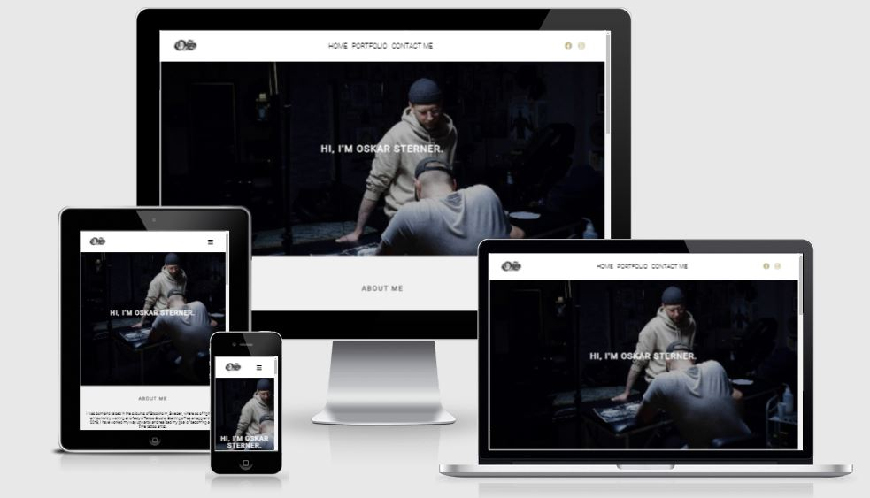
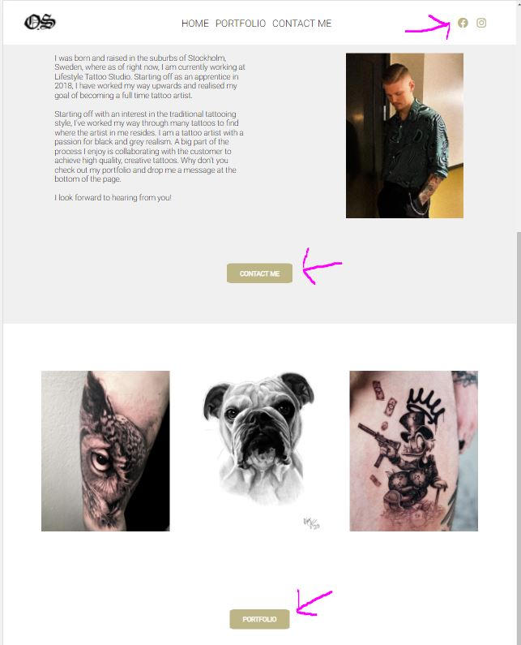
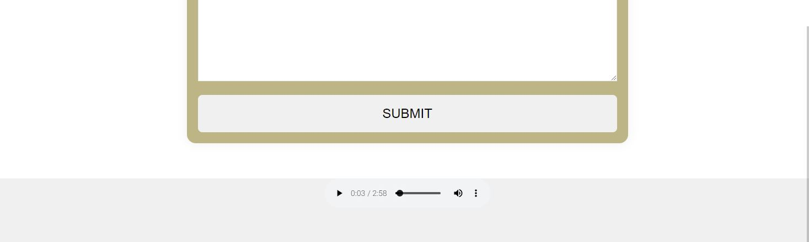
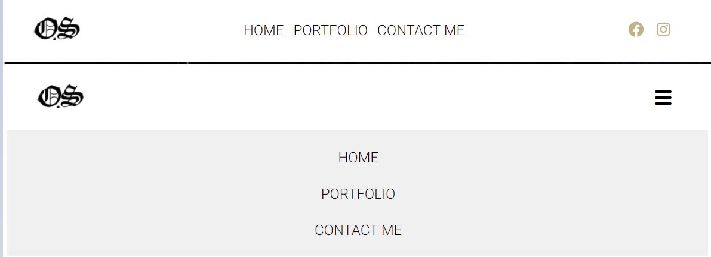
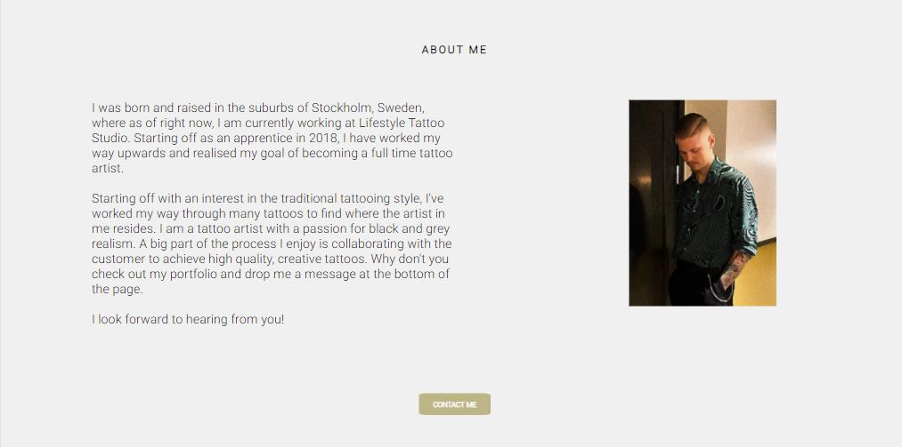
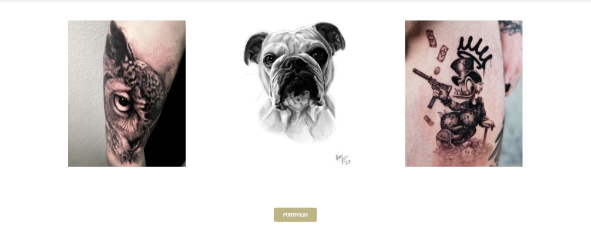
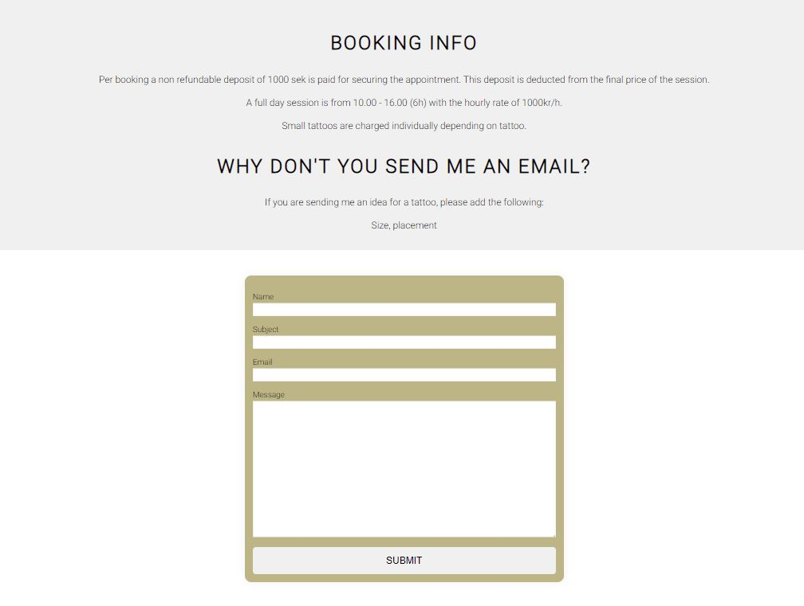
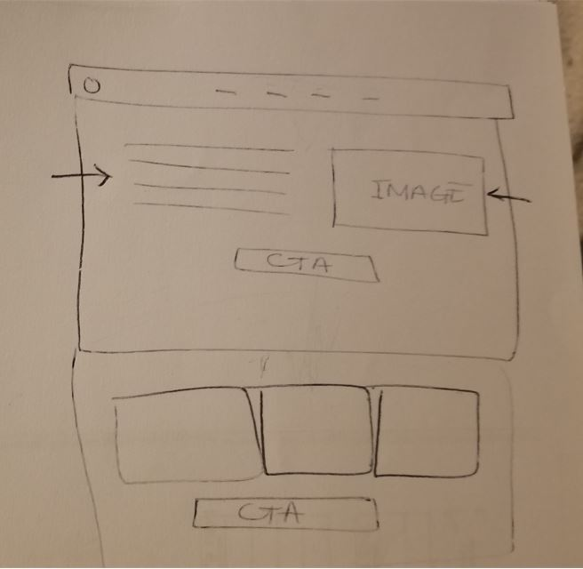

# OS
OS tattoo website is a personal webpage for the tattoo artist to easier be able to share his art aswell as getting new bookings.

The customers will be able to see his style and previous art in the portfolio,
and get relivant information about time, cost etc.

---

# Features
- Navigation

  - There is three navigation links, contact me, portfolio and home page which links to three different pages.
  -  During smaller screens sizes will the 3 navigation links will be hidden inside a burger menu that will slide down across the screen when clicked.
  - all 3 navigation links have a golden hover effect on them to show when the mouse is over a clickable button.
  - There are 2 buttons on the home page for faster and easy access back to the other two pages.
  - In window mode two fast links to social media pages can be reached in the top right corner. These links will open up in a new window.

 - In the footer on the Contact me page is a music player for some nice tunes while filling in the form
 

# Header
 - The header shows the artist logo aswell as social media link and easy navigation across the website.

 

 # About us
 About us is not a page by it self but it has instead been featured on the home page. 
 

 # Portfolio-teaser
 Below the portfolio is 3 images working as a teaser showing off some of the artists work. There is a quick acess button underneath the images directly to the portfolio where there is more content.

 

 # Contact form
 On the third page a contact form and some basic informations about working hours and prices will be provided.

 

 # Testing
 - I comfirmed that this project is responsiv, looks good and functions on all standard screen sizes  using the devtool device.
 - I have comfirmed that the form works: requires entries in every field.
 - I have comfirmed that all links works.

 # Bugs
 - There was issues when going down to smaller screensizes due to lack of flexibility in certain images which made small screensizes floated outside of the screen so the burger menu was not reachable. Making the problematic images responsive fixed this issue. 
 - the portfolio didnt line up properly and started to fill up from the top and down not from side to side. Removing a few images and changing the size fixed this issue.

# Validator testing
- html
    - No error were returned when passing through the offical w3C validator
- css 
    - No error were returned when passing through the offical jigsaw validator

- accessibility
    - The webpaged had good accessibility however due to many large pictures made the website work slowly and that made the performance go down.
    

# Unfixed Bugs
No unfixed bugs

# Deployment
- The site was deployed to github pages. The steps to deply are as follows:
    - in the Github repository, navigate to the settings tab.
    - From the source section drop-down menu, select the main branch.
    - Once the main branch has been selected, the page provided the  link to the completed website.
The live link can be found here - https://stuffy33.github.io/OS/

# Content
- The code for portfolio has been taken / inspired by the Love running project.
- Kevin Powell = Css inspiration for nav bar
- Martina_mentor = Guidence
- Daisy_mentor = Guidence
- W3schools = Flexbox
- Fontawesome = Burger menu
- google fonts = roboto
- Oskar Sterner = Images ( have permission to use his content)
- figma = change image sizes
- soundcloud/MBB = https://soundcloud.com/mbbofficial/sky

# Font
- https://fonts.google.com/specimen/Roboto

# Icon
- https://fontawesome.com/search?q=bars&s=solid%2Cbrands

# color
 - rgb(240, 240, 240)
 - #ffffff
 - black
 - c0b386
 - rgba(128, 128, 128)
 - #00000010

 # Wireframe
 - simple wireframe made by hand for the home page
 - Unfortunatly the other 2 wireframes have been in an accident. Suspects: late night and coffee 

 